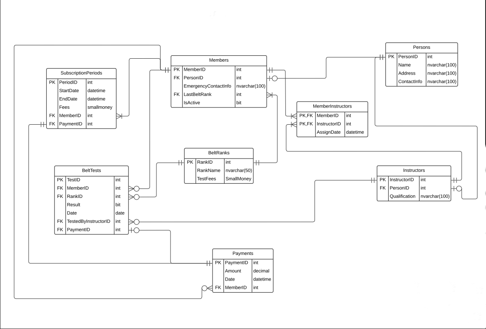

# Karate Club Database

The Karate Club database is designed to manage information about the club's members, instructors, belt ranks, payments, and belt tests. It includes several tables that store relevant data and relationships between them. Below is a description of the tables and some sample scripts for database verification.

## 

## Tables

### Persons

The `Persons` table stores details about club members and instructors.

- `PersonId` (Primary Key): Unique identifier for persons.
- `Name`: Name of the person.
- `DateOfBirth`: Date of birth.
- `Gender`: Gender (M for Male, F for Female).
- `Phone`: Phone number.
- `Email`: Email address.
- `Address`: Address.
- Constraints:
  - `Name` is unique.

### Instructors

The `Instructors` table stores details about the club's instructors.

- `InstructorID` (Primary Key): Unique identifier for instructors.
- `PersonId` (Foreign Key): Reference to the person associated with the instructor.
- `Qualifications`: Instructor's qualifications.

### BeltRanks

The `BeltRanks` table stores details about different belt ranks.

- `RankID` (Primary Key): Unique identifier for belt ranks.
- `RankName`: Name of the belt rank.
- `TestFees`: Fees for taking a test to achieve the belt rank.
- `BeltRankDescription`: Additional information about the belt rank.

### Members

The `Members` table stores details about club members.

- `MemberID` (Primary Key): Unique identifier for members.
- `PersonId` (Foreign Key): Reference to the person associated with the member.
- `LastBeltRank` (Foreign Key): Reference to the member's last achieved belt rank.
- `IsActive`: Indicates if the member is currently active.

### MemberInstructors

The `MemberInstructors` table stores relationships between members and instructors.

- `MemberID` (Foreign Key): Reference to the member.
- `InstructorID` (Foreign Key): Reference to the instructor.
- `AssignDate`: Date of assignment.

### Payments

The `Payments` table stores details about payments made by members.

- `PaymentID` (Primary Key): Unique identifier for payments.
- `Amount`: Payment amount.
- `Date`: Payment date.
- `MemberID` (Foreign Key): Reference to the member associated with the payment.

### SubscriptionPeriods

The `SubscriptionPeriods` table stores details about subscription periods.

- `PeriodID` (Primary Key): Unique identifier for subscription periods.
- `StartDate`: Start date of the subscription period.
- `EndDate`: End date (one year from the start date).
- `Fees`: Subscription fees.
- `MemberID` (Foreign Key): Reference to the member associated with the subscription period.
- `PaymentID` (Foreign Key): Reference to the payment associated with the subscription period.

### BeltTests

The `BeltTests` table stores details about belt tests.

- `TestID` (Primary Key): Unique identifier for belt tests.
- `MemberID` (Foreign Key): Reference to the member taking the test.
- `RankID` (Foreign Key): Reference to the belt rank being tested.
- `Result`: Test result (0 for failed, 1 for passed).
- `Date`: Test date.
- `TestedByInstructorID` (Foreign Key): Reference to the instructor who conducted the test.
- `PaymentID` (Foreign Key): Reference to the payment associated with the test.


## SQL Scripts

- `schema.sql`: Contains SQL statements to create the database schema.
- `insert-data.sql`: Includes SQL statements to insert sample data into the tables.


## Getting Started

1. Clone this repository to your local machine:
   ```bash
   git clone https://github.com/mattar740/DataBase/Project_3_Karate_Club.git
   ```
2. Create a SQL Server database and execute the schema.sql script to create the necessary tables and constraints.

3. Execute the insert-data.sql script to insert sample data into the tables.

## Usage
. Use these SQL scripts to set up a Karate Club management system database or as a reference for integrating a database into your own project.
. Customize the data in the insert-data.sql script to match the specifics of your Karate Club.

## Sample Scripts

### Inserting an Instructor with Qualifications

To insert a new instructor with qualifications, use the following script:

```sql
-- Insert a new Person
-- INSERT INTO Persons (Name, DateOfBirth, Gender, Phone, Email, Address) VALUES ...

-- Get the PersonId of the newly inserted Person

-- Insert a new Instructor with the corresponding PersonId and Qualifications
-- INSERT INTO Instructors(PersonId, Qualifications) VALUES ...
```

## Inserting a Member and Generating a Subscription Period
To insert a new member and generate a subscription period, use the following script:

```sql
-- Insert a new Person
-- INSERT INTO Persons (Name, DateOfBirth, Gender, Phone, Email, Address) VALUES ...

-- Get the PersonId of the newly inserted Person

-- Insert a new Member with the corresponding PersonId

-- Insert a new Payment record

-- Get the PaymentID of the newly inserted Payment

-- Insert a new SubscriptionPeriod for the member
-- INSERT INTO SubscriptionPeriods (StartDate, Fees, MemberID, PaymentID) VALUES ...
```

## Inserting a Belt Test Record
To insert a belt test record, use the following script:

```sql
-- Get The Member

-- Get The Rank

-- Get the instructor's ID

-- Insert a new Payment record
-- first get the Payment amount 

-- Get the PaymentID of the newly inserted Payment

-- Insert a new BeltTest record
-- INSERT INTO BeltTests (MemberID, RankID, Result, TestedByInstructorID, PaymentID) VALUES ...
```

## Full Real Example
Test Scripts for Database Verification
Important Note: Execute Each Script Separately to Prevent Errors; Avoid Running All at Once Take Care, Bro

- Example to insert an Instructor with Qualifications
```sql
BEGIN TRANSACTION; -- Start a transaction
-- Insert a new Person
INSERT INTO Persons (Name, DateOfBirth, Gender, Phone, Email, Address)
VALUES ('Ali Emad', '1980-01-15', 'M', '01123456789', 'karate.master@example.com', '456 Elm St');

-- Get the PersonId of the newly inserted Person
DECLARE @NewPersonId INT;
SELECT @NewPersonId = SCOPE_IDENTITY();

-- Insert a new Instructor with the corresponding PersonId and Qualifications
INSERT INTO Instructors(PersonId, Qualifications)
VALUES (@NewPersonId, '5th Dan Black Belt in Karate, Certified Karate Instructor, 15+ years of teaching experience'); 

COMMIT; -- Commit the transaction if both inserts are successful
```

- Example to insert a Member and Generate his own Subscription Periods

```sql
BEGIN TRANSACTION; -- Start a transaction

-- Insert a new Person
INSERT INTO Persons (Name, DateOfBirth, Gender ,Phone, Email, Address)
VALUES ('Mahmoud Mohamed', '1998-03-03', 'M', '01019060452', 'Mahmoud@example.com', '123 Main St');

-- Get the PersonId of the newly inserted Person
DECLARE @NewPersonId INT;
SELECT @NewPersonId = SCOPE_IDENTITY();

-- Insert a new Member with the corresponding PersonId
-- Assuming the Member is a Beginner so he will has a 'White Belt'
DECLARE @BeltRank INT;
SELECT @BeltRank = (SELECT RankID from BeltRanks WHERE RankName = 'White Belt');
INSERT INTO Members(PersonId, LastBeltRank, IsActive)
VALUES (@NewPersonId, @BeltRank, 1); 

-- Get the Inserted Member's ID
DECLARE @MemberID INT;
SELECT @MemberID = Members.MemberID 
FROM Members 
WHERE Members.PersonId = @NewPersonId;


-- Assign an instructor
DECLARE @instructor INT;

-- Get the instructor's ID
SELECT @instructor = Instructors.InstructorID
FROM Instructors
JOIN Persons ON Persons.PersonId = Instructors.PersonId
WHERE Persons.Name = 'Ali Emad';

-- Insert the instructor-member relationship into the MemberInstructors table
INSERT INTO MemberInstructors (MemberID, InstructorID, AssignDate)
VALUES (@MemberID, @instructor, GETDATE());

-- Insert a new Payment record
DECLARE @PaymentID INT;
INSERT INTO Payments (Amount, Date, MemberID)
VALUES (100, GETDATE(), @MemberID);

-- Get the PaymentID of the newly inserted Payment
SELECT @PaymentID = SCOPE_IDENTITY();

-- Insert a new SubscriptionPeriod for the member
INSERT INTO SubscriptionPeriods (StartDate, Fees, MemberID, PaymentID)
VALUES (GETDATE(), 100, @MemberID, @PaymentID);

COMMIT; -- Commit the transaction if all inserts are successful
```

- Example To Insert a Belt Test record
```sql
BEGIN TRANSACTION; -- Start a transaction

-- Get The Member
DECLARE @MemberID INT;
SELECT @MemberID = Members.MemberID from Members
JOIN Persons ON Persons.PersonId = Members.PersonId
WHERE Persons.Name = 'Mahmoud Mohamed';

-- Get The Rank
DECLARE @RankID INT;
SELECT @RankID = BeltRanks.RankID from BeltRanks
WHERE BeltRanks.RankName = 'Black Belt (1st Dan)';

-- Get the instructor's ID
DECLARE @instructor INT;
SELECT @instructor = Instructors.InstructorID
FROM Instructors
JOIN Persons ON Persons.PersonId = Instructors.PersonId
WHERE Persons.Name = 'Ali Emad';

-- Insert a new Payment record
-- first get the Payment amount 
DECLARE @PaymentAmount DECIMAL;
SELECT @PaymentAmount = TestFees fROM BeltRanks Where BeltRanks.RankID = @RankID

DECLARE @PaymentID INT;
INSERT INTO Payments (Amount, Date, MemberID)
VALUES (@PaymentAmount, GETDATE(), @MemberID);

-- Get the PaymentID of the newly inserted Payment
SELECT @PaymentID = SCOPE_IDENTITY();

INSERT INTO BeltTests (MemberID, RankID, Result, TestedByInstructorID, PaymentID)
VALUES (@MemberID, @RankID, Null, @instructor, @PaymentID);
COMMIT; -- Commit the transaction if all inserts are successful
```

## Remember That is the Best Practice To use error handling It will help ensure the reliability and maintainability of The scripts

```sql
BEGIN TRY
    BEGIN TRANSACTION;

    -- Get The Member
    DECLARE @MemberID INT;
    SELECT @MemberID = Members.MemberID
    FROM Members
    JOIN Persons ON Persons.PersonId = Members.PersonId
    WHERE Persons.Name = 'Mahmoud Mohamed';

    -- Get The Rank
    DECLARE @RankID INT;
    SELECT @RankID = BeltRanks.RankID
    FROM BeltRanks
    WHERE BeltRanks.RankName = 'Black Belt (1st Dan)';

    -- Get the instructor's ID
    DECLARE @instructor INT;
    SELECT @instructor = Instructors.InstructorID
    FROM Instructors
    JOIN Persons ON Persons.PersonId = Instructors.PersonId
    WHERE Persons.Name = 'Ali Emad';

    -- Get the payment amount for the belt test
    DECLARE @PaymentAmount DECIMAL;
    SELECT @PaymentAmount = TestFees
    FROM BeltRanks
    WHERE BeltRanks.RankID = @RankID;

    -- Insert a new Payment record
    DECLARE @PaymentID INT;
    INSERT INTO Payments (Amount, Date, MemberID)
    VALUES (@PaymentAmount, GETDATE(), @MemberID);

    -- Get the PaymentID of the newly inserted Payment
    SELECT @PaymentID = SCOPE_IDENTITY();

    -- Insert a new Belt Test record
    INSERT INTO BeltTests (MemberID, RankID, Result, TestedByInstructorID, PaymentID)
    VALUES (@MemberID, @RankID, NULL, @instructor, @PaymentID);

    COMMIT; -- Commit the transaction if all inserts are successful
END TRY
BEGIN CATCH
    -- Handle any errors here, you can log them or perform other actions
    ROLLBACK; -- Rollback the transaction to maintain data consistency
    -- Rethrow the error or perform additional error handling as needed
END CATCH;

```


- Feel free to customize and extend the database schema to meet your specific requirements.

## Author

- Mahmoud Mohamed
- Email: mahmoud.abdalaziz@outlook.com
- LinkedIn: [Mahmoud Mohamed Abdalaziz](https://www.linkedin.com/in/mahmoud-mohamed-abd/)

Happy learning and coding! 🚀
