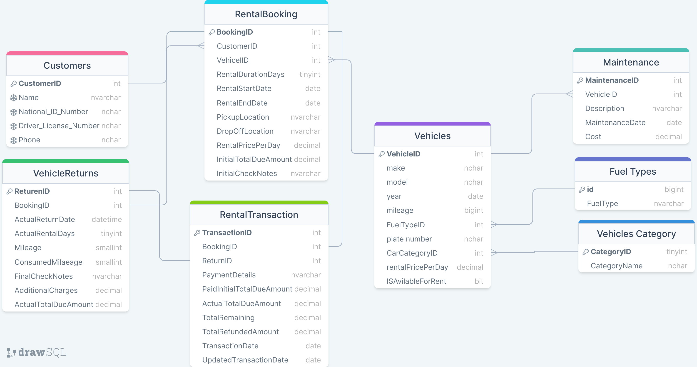

# Car Rental Management System

 Welcome to the Car Rental Management System, a comprehensive database designed to streamline the operations of your car rental business efficiently.

## Project Purpose

Hello, I am Mahmoud, a CS student. This project has been created with the primary goal of providing me with a hands-on learning experience in database management. While the system's capabilities are well-suited for a car rental business, please note that the primary objective here is educational, and it is not intended for commercial use.

The Car Rental Management System serves as a learning tool, allowing me to practice and implement the database design principles I've studied. I can use this system to gain a deeper understanding of how databases work in real-world scenarios, enhancing my knowledge and skills in the field of database management.

## Table of Contents
1. [Relational Schema](#relational-schema)
2. [Project Structure](#project-structure)
3. [Database Schema](#database-schema)
4. [Usage](#usage)
5. [Sample Scripts](#Usage_Examples)
6. [License](#license)
7. [Author](#Author)

## Relational Schema



## Project Structure

The project repository contains the following files:

- `Requirements.pdf`: This document contains the project requirements and specifications.

- `schema.sql`: The SQL script to create the database schema for the Car Rental Management System.

- `insert-data.sql`: This SQL script provides sample data to populate the database tables, demonstrating how to add customers, fuel types, vehicle categories, vehicles, and make rental bookings.

## Database Schema

The schema for the database includes the following tables:
- Customers
- FuelTypes
- VehiclesCategory
- Vehicles
- Maintenance
- RentalBooking
- VehicleReturns
- RentalTransaction

The database schema is defined in the `schema.sql` file.

## Usage

1. Import the database schema by running the `schema.sql` script on your SQL Server.

2. Insert sample data and records using the `insert-data.sql` script as an example. You can customize this script to add more data as needed.

3. The system is now ready for you to manage your car rental business. Use SQL queries to interact with the database and perform operations such as booking rentals, returning vehicles, and managing customer data.

4. Ensure to update and customize the scripts for your specific use case, including real customer data, vehicle details, and booking information.


## Usage Examples

**Booking a Rental**:

Suppose you want to book a rental for a customer. You can use the following SQL script as an example:

```sql
-- To insert a new customer and book a rental, use the following script:
-- Insert a new Customer
-- INSERT INTO Customers (CustomerName, National_ID_Number, Driver_License_Number, Phone) VALUES ...

-- Get the CustomerID of the newly inserted Customer

-- Get the VehicleID based on availability and criteria

-- Insert a new RentalBooking record
-- INSERT INTO RentalBooking (CustomerID, VehicleID, RentalDurationDays, RentalStartDate, PickupLocation, DropOffLocation, RentalPricePerDay, InitialCheckNotes) VALUES ...
```

## Full Real Examples
Test Scripts for Database Verification
*Important Note: Execute Each Script Separately to Prevent Errors; Avoid Running All at Once Take Care, Bro*

- Example to insert fuel types
```SQL
-- Insert sample fuel types into the FuelTypes table
INSERT INTO FuelTypes (ID, FuelType) VALUES
(1, 'Gasoline (Petrol)'),
(2, 'Diesel'),
(3, 'Electric'),
(4, 'Hybrid');

```

- Example to insert vehicle categories
```SQL
-- Insert sample vehicle categories into the VehiclesCategory table
INSERT INTO VehiclesCategory (CategoryName) VALUES
('4x4'),
('Sedan'),
('SUV'),
('Sports Car'),
('Minivan');
```

-- Example to Insert Vehicles
```sql
-- Insert a Sample Vehicles
INSERT INTO Vehicles (Make, Model, Year, mileage, FuelTypeID, PlateNumber, CarCategoryID, RentalPricePerDay, ISAvilableForRent)
VALUES ('Toyota', 'Camry', '2021-01-01', 10000, 1, 'ABC123', 1, 50.00, 1),
	   ('Tesla', 'Model 3', '2023-01-01', 0, 4, 'TESLA001', 2, 80.00, 1);

```

- Insert a Vehicle by specifying FuelType and CarCategory
```sql
DECLARE @FuelTypeID INT, @CarCategoryID INT;

-- Get the FuelTypeID for 'Gasoline' fuel type
SELECT @FuelTypeID = ID FROM FuelTypes WHERE FuelType LIKE '%Gasoline%';

-- Get the CarCategoryID for 'Sports' category
SELECT @CarCategoryID = CategoryID FROM VehiclesCategory WHERE CategoryName LIKE '%Sports%';

-- Insert the vehicle into the Vehicles table
INSERT INTO Vehicles (Make, Model, Year, Mileage, FuelTypeID, PlateNumber, CarCategoryID, RentalPricePerDay, ISAvilableForRent)
VALUES ('Honda', 'Civic', '2020-01-01', 8000, @FuelTypeID, 'XYZ789', @CarCategoryID, 45.00, 1);
```

- Example to insert customers
```sql
-- Insert the first customer
INSERT INTO Customers (CustomerName, National_ID_Number, Driver_License_Number, Phone)
VALUES ('Mahmoud Mohamed', '29803031401528', '56789012345678', '01019760452');

-- Insert the second customer
INSERT INTO Customers (CustomerName, National_ID_Number, Driver_License_Number, Phone)
VALUES ('Mohamed Salah', '30003031491528', '43210987654321', '01129416608');
```

- Example to insert a booking record

```sql
-- Start a transaction
BEGIN TRANSACTION;

-- Declare variables for input data
DECLARE @CustomerID INT, @VehicleID INT, @RentalDurationDays TINYINT, 
@PickupLocation NVARCHAR(100), @DropOffLocation NVARCHAR(100), 
@RentalPricePerDay SMALLMONEY, @InitialCheckNotes NVARCHAR(500);

-- Assign values to the variables

-- Assume that the customer who is going to rent the car already exists in the database, 
-- so we don't need to include him as a new record
SELECT @CustomerID = (SELECT CustomerID FROM Customers WHERE CustomerName = 'Mahmoud Mohamed');

-- Retrieve the VehicleID from the Vehicles table
SELECT @VehicleID = (SELECT TOP 1 VehicleID FROM Vehicles 
WHERE Make = 'Toyota' AND Year = '2021-01-01' AND Model = 'Camry' AND ISAvilableForRent = 1);

-- Retrieve the RentalPricePerDay from the Vehicles table Based On VehicleID
SELECT @RentalPricePerDay = (SELECT RentalPricePerDay FROM Vehicles WHERE VehicleID = @VehicleID);

-- Set other variables
SELECT @RentalDurationDays = 7;
SELECT @PickupLocation = 'Test Pickup Location';
SELECT @DropOffLocation = 'Test DropOff Location';
SELECT @InitialCheckNotes = 'Test Check Notes';

-- Insert the rental booking record
INSERT INTO RentalBooking (CustomerID, VehicleID, RentalDurationDays, RentalStartDate, PickupLocation, DropOffLocation, RentalPricePerDay, InitialCheckNotes)
VALUES (
    @CustomerID,
    @VehicleID,
    @RentalDurationDays,
    GETDATE(), -- Use the current date as the start date 
    @PickupLocation,
    @DropOffLocation,
    @RentalPricePerDay,
    @InitialCheckNotes
);

-- Check if the insertion was successful
IF @@ERROR = 0
BEGIN
    -- If successful, commit the transaction
	-- Note: Don't Forget To Set 'ISAvilableForRent' Vehicles Column To 0
	UPDATE Vehicles
	SET ISAvilableForRent = 0
	WHERE VehicleID = @VehicleID;

    COMMIT;
    PRINT 'Transaction committed successfully.';
END
ELSE
BEGIN
    -- If unsuccessful, roll back the transaction
    ROLLBACK;
    PRINT 'Transaction rolled back due to an error.';
END;
```

- Example for Inserting a Record into VehicleReturns table and RentalTransaction table

```sql

-- Start a transaction
BEGIN TRANSACTION;

-- Declare variables for input data
DECLARE 
@BookingID INT, 
@ActualReturnDate DATETIME,
@ActualRentalDays TINYINT,
@Mileage SMALLINT,
@ConsumedMileage SMALLINT,
@FinalCheckNotes NVARCHAR(500),
@AdditionalCharges SMALLMONEY, 
@ActualTotalDueAmount SMALLMONEY;

-- Assign values to the variables

SELECT @BookingID = 1; -- Replace with the actual BookingID
SELECT @ActualReturnDate = '2023-10-25 12:00:00';

-- Calculate the number of rental days
SELECT @ActualRentalDays = DATEDIFF(DAY, (SELECT RentalStartDate FROM RentalBooking WHERE BookingID = @BookingID), @ActualReturnDate);


SELECT @Mileage = 10200; -- Replace with the actual Mileage

-- Calculate the consumed mileage
SELECT @ConsumedMileage = @Mileage - (SELECT Vehicles.mileage
FROM RentalBooking
JOIN Vehicles ON Vehicles.VehicleID = RentalBooking.VehicleID
WHERE RentalBooking.BookingID = @BookingID);

-- Set other variables
SELECT @FinalCheckNotes = 'All good'; -- Replace with the actual notes
SELECT @AdditionalCharges = 25.00; -- Replace with the actual charges

-- Calculate the actual total due amount
-- To determine the total due amount, we first need to fetch the 'RentalPricePerDay' from the Vehicles table, 
-- which is based on the VehicleID obtained from the RentalBooking table using the @BookingID.
-- Next, we calculate the total by multiplying '@ActualRentalDays' by 'RentalPricePerDay' and adding the '@AdditionalCharges'.

DECLARE @VehicleID INT;

-- Retrieve the VehicleID associated with the @BookingID from the RentalBooking table, 
-- which we will use to fetch the 'RentalPricePerDay' from the Vehicles table.
SELECT @VehicleID = (SELECT VehicleID FROM RentalBooking WHERE VehicleID = @BookingID)
PRINT @VehicleID

-- Calculate the actual total due amount, taking into account the rental duration and any additional charges.
SELECT @ActualTotalDueAmount = (@ActualRentalDays * (SELECT RentalPricePerDay FROM Vehicles WHERE VehicleID = @VehicleID)) + @AdditionalCharges;


-- Insert the record into the VehicleReturns table
INSERT INTO VehicleReturns (BookingID, ActualReturnDate, ActualRentalDays, Mileage, ConsumedMileage, FinalCheckNotes, AdditionalCharges, ActualTotalDueAmount)
VALUES (
	@BookingID, 
	@ActualReturnDate, 
	@ActualRentalDays, 
	@Mileage, 
	@ConsumedMileage, 
	@FinalCheckNotes, 
	@AdditionalCharges, 
	@ActualTotalDueAmount
);

-- Retrieve the ReturnID of the inserted record
DECLARE @ReturnID INT;
SELECT @ReturnID = SCOPE_IDENTITY();

-- Insert the corresponding record into the RentalTransaction table
INSERT INTO RentalTransaction (
	BookingID, ReturnID, PaymentDetails, PaidInitialTotalDueAmount, ActualTotalDueAmount, 
	TotalRemaining, TotalRefundedAmount, TransactionDate, UpdatedTransactionDate)
VALUES (
	@BookingID, 
	@ReturnID, 
	'Payment received for initial booking',  -- Provide more specific information about the payment
	100.00, 
	@ActualTotalDueAmount, 
	---- Calculate TotalRemaining
	CASE
		WHEN @ActualTotalDueAmount > 100.00 THEN @ActualTotalDueAmount - 100.00
		ELSE 0.00  -- Ensure that TotalRemaining is not negative
	END,
	-- Calculate TotalRefundedAmount
	CASE
		WHEN 100.00 > @ActualTotalDueAmount THEN 100.00 - @ActualTotalDueAmount
		ELSE 0.00  -- Ensure that TotalRefundedAmount is not negative
	END,
	GETDATE(), 
	NULL
);


-- Check if the insertion was successful
IF @@ERROR = 0
BEGIN
    -- If successful, commit the transaction

	-- Note: Don't Forget To Update 'mileage' Vehicles Column To The New Mileage '@Mileage'
	UPDATE Vehicles
    SET mileage = @Mileage
    WHERE VehicleID = @VehicleID;

	-- Note: Set 'ISAvilableForRent' in the Vehicles table to 1 if the FinalCheckNotes indicate that the vehicle is in good condition
    -- (Assuming '0' represents a problem with the car)
    IF @FinalCheckNotes <> '0'
    BEGIN
        UPDATE Vehicles
        SET ISAvilableForRent = 1
        WHERE VehicleID = @VehicleID;
    END

    COMMIT;
    PRINT 'Transaction committed successfully.';
END
ELSE
BEGIN
    -- If unsuccessful, roll back the transaction
    ROLLBACK;
    PRINT 'Transaction rolled back due to an error.';
END;
```

- Feel free to customize and extend the database schema to meet your specific requirements.

## License
This project is licensed under the [MIT License](LICENSE). You are free to use, modify, and distribute this code as per the license terms.

## Author

- Mahmoud Mohamed
- Email: mahmoud.abdalaziz@outlook.com
- LinkedIn: [Mahmoud Mohamed Abdalaziz](https://www.linkedin.com/in/mahmoud-mohamed-abd/)
- GitHub: [mattar740](https://github.com/mattar740)

Have a great time Happy learning and coding! 🚀
