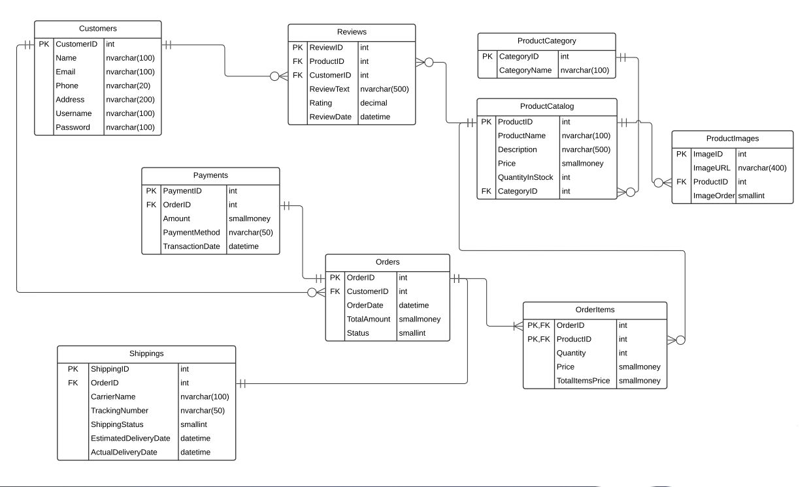

# Database Training Project - OnlineStore

## Project Description
This repository contains SQL scripts and related files for a database training project focused on an online store. The project's primary purpose is to provide a hands-on learning experience in database management. While the project's capabilities are well-suited for an online store business, it's important to note that the primary objective here is educational, and it's not intended for commercial use.

The OnlineStore Database serves as a valuable learning tool, allowing you to practice and implement the database design principles you've studied. You can use this system to gain a deeper understanding of how databases work in real-world scenarios, enhancing your knowledge and skills in the field of database management.


## Installation and Usage
- To use this project, follow these steps:
1. Make sure you have SQL Server installed on your system.
2. Import the database schema by running the schema.sql script on your SQL Server. This script creates the necessary tables, constraints, and relationships.
3. Insert sample data and records using the insert-data.sql script as an example. You can customize this script to add more data as needed.
4. Browse the Examples.sql file and try the examples provided, and you can add examples of your own.
5. Update and customize the scripts to meet your specific use case.

## Project Files

- **Requirements.pdf**: This file contains the project requirements and specifications, providing an overview of the database design and expected functionalities.

- **relational_schema_diagram.png**: An image file showing the relational schema diagram of the database.

- **Schema.sql**: SQL script to create the database schema, including tables, constraints, and relationships.

- **insert-data.sql**: SQL script to insert sample data into the database tables to test and validate the database functionality.

- **Examples.sql**: This File Contains Some Example Queries for Using the OnlineStore Database Schema These queries demonstrate how to perform various operations with the database, such as updating customer information, retrieving orders, calculating sales, and more. You can use these examples as a reference to understand and work with the database.


## Relational Schema



- You can view the [DrawSQL diagram here](https://drawsql.app/teams/m7/diagrams/Online-Store).


## Database Schema

The project defines the following tables in the database schema:

- Customers: Stores customer information.
- ProductCategory: Contains product categories.
- ProductCatalog: Stores information about products available in the store.
- ProductImages: Records product images associated with products.
- OrderStatus: Defines various order statuses.
- Orders: Manages customer orders and order status.
- Reviews: Records customer reviews for products.
- OrderItems: Tracks items included in orders.
- Payments: Manages payment information for orders.
- Shippings: Handles shipping and delivery details for orders.
The database schema has been designed to support the functionality of an online store.


## Example Data
In addition to the examples provided, you can find more diverse and complex examples in the repository. These examples illustrate how the database schema can be applied in various scenarios.

## Code Comments
I've added inline comments within the SQL code to make it more understandable, especially for beginners. These comments explain complex queries and the reasoning behind certain decisions.

## Full Real Examples
**Test Scripts for Database Verification**

**Important Note: Execute Each Script Separately to Prevent Errors; Avoid Running All at Once Take Care, Bro**


- Example to Insert product categories

```SQL
INSERT INTO ProductCategory (CategoryName)
VALUES
    ('Electronics'),
    ('Clothing'),
    ('Home & Kitchen'),
    ('Books & Literature'),
    ('Toys & Games'),
    ('Health & Beauty'),
    ('Sports & Outdoors'),
    ('Food & Grocery'),
    ('Furniture'),
    ('Jewelry'),
    ('Automotive'),
    ('Music & Instruments'),
    ('Pets & Animals'),
    ('Arts & Crafts'),
    ('Office Supplies'),
    ('Travel & Luggage');
```

- Example to Insert shipping status values
```sql
INSERT INTO OrderStatus
VALUES
    ('Processing'), -- Order is being processed
    ('Out for Delivery'), -- Order is out for delivery to the customer
    ('Delivered'), -- Order has been successfully delivered
    ('Return to Sender'), -- Package is being returned to the sender
    ('On Hold'), -- Order is on hold due to some issue Or something Else
    ('Delayed'), -- Order is experiencing delays in shipping
    ('Lost'); -- Order has been lost in transit
```

- Example to insert customers
```sql
INSERT INTO Customers(CustomerName, Email, Phone, Address, Username, Password)
VALUES ('Mahmoud Mohamed', 'Mahmoud_mohamed@gmail.com', '01019060452', '123 Main St', 'M7_123', 'Mm#0123'),
	   ('Mohamed Salah', 'MOSalah11@gmail.com', '01129816608', '123 Main ST', 'MO11','MO_@123');
```

- Example to insert product catalog information
```sql
INSERT INTO ProductCatalog (ProductName, Description, Price, QuantityInStock, CategoryID)
VALUES
    ('Smartphone X1', 'High-end smartphone with advanced features', 699.99, 100, 1), -- Category: Electronics
    ('Men''s Casual Shirt', 'Comfortable and stylish men''s shirt', 39.99, 200, 2), -- Category: Clothing
    ('Kitchen Blender', 'Powerful blender for smoothies and more', 79.99, 50, 3), -- Category: Home & Kitchen
    ('The Great Gatsby (Paperback)', 'Classic novel by F. Scott Fitzgerald', 12.99, 30, 4), -- Category: Books & Literature
    ('Lego Building Set', 'Creative building blocks for kids', 29.99, 100, 5), -- Category: Toys & Games
    ('Organic Shampoo', 'Natural hair care product for shiny hair', 14.99, 80, 6); -- Category: Health & Beauty


-- Insert product images
INSERT INTO ProductImages (ImageURL, ProductID, ImageOrder)
VALUES
    ('/images/product1-1.jpg', 1, 1),  -- Image 1 for ProductID 1 (Smartphone X1)
    ('/images/product1-2.jpg', 1, 2),  -- Image 2 for ProductID 1 (Smartphone X1)
    ('/images/product2-1.jpg', 2, 1),  -- Image 1 for ProductID 2 (Men's Casual Shirt)
    ('/images/product3-1.jpg', 3, 1),  -- Image 1 for ProductID 3 (Kitchen Blender)
    ('/images/product4-1.jpg', 4, 1),  -- Image 1 for ProductID 4 (The Great Gatsby)
    ('/images/product5-1.jpg', 5, 1),  -- Image 1 for ProductID 5 (Lego Building Set)
    ('/images/product6-1.jpg', 6, 1);  -- Image 1 for ProductID 6 (Organic Shampoo)
```

- Example To Initiate a Transaction for Order Processing
```sql
BEGIN TRY
    BEGIN TRANSACTION;

    -- Declare and initialize variables
    DECLARE @CustomerID INT, @OrderID INT, @ProductID INT, @Quantity INT, @Price SMALLMONEY, @TotalItemsPrice SMALLMONEY, @Amount SMALLMONEY;

    -- Retrieve the CustomerID for an existing customer
    SELECT @CustomerID = CustomerID FROM Customers WHERE Username = 'M7_123';

    -- Insert a new order
    INSERT INTO Orders (CustomerID, OrderDate, TotalAmount, StatusID)
    VALUES (
        @CustomerID, -- Customer placing the order
        GETDATE(), -- Date and time of the order placement
        NULL, -- Total amount initially set to NULL (to be updated)
        1 -- Initial status: Processing
    );

    -- Get the OrderID of the newly inserted order
    SELECT @OrderID = SCOPE_IDENTITY();

    -- Add a product to the order
    -- Product: Smartphone X1
    SELECT @ProductID = ProductID, @Quantity = 2, @Price = Price
    FROM ProductCatalog
    WHERE ProductName = 'Smartphone X1';

    SELECT @TotalItemsPrice = @Quantity * @Price;

    -- Insert product into the order
    INSERT INTO OrderItems (OrderID, ProductID, Quantity, Price, TotalItemsPrice)
    VALUES (@OrderID, @ProductID, @Quantity, @Price, @TotalItemsPrice);

    -- Add another product to the order
    -- Product: Kitchen Blender
    SELECT @ProductID = ProductID, @Quantity = 4, @Price = Price
    FROM ProductCatalog
    WHERE ProductName = 'Kitchen Blender';

    SELECT @TotalItemsPrice = @Quantity * @Price;

    -- Insert the second product into the order
    INSERT INTO OrderItems (OrderID, ProductID, Quantity, Price, TotalItemsPrice)
    VALUES (@OrderID, @ProductID, @Quantity, @Price, @TotalItemsPrice);

    -- Calculate and update the TotalAmount in the Orders table
    UPDATE Orders
    SET TotalAmount = (SELECT SUM(TotalItemsPrice) FROM OrderItems WHERE OrderID = @OrderID)
    WHERE OrderID = @OrderID;

    -- Insert the payment for the order
    SELECT @Amount = TotalAmount
    FROM Orders
    WHERE OrderID = @OrderID;

    INSERT INTO Payments (OrderID, Amount, PaymentMethod)
    VALUES (@OrderID, @Amount, 'VISA CARD');

    -- Insert shipping data
    INSERT INTO Shippings (OrderID, CarrierName, TrackingNumber, ShippingStatusID, EstimatedDeliveryDate, ActualDeliveryDate)
    VALUES (
        @OrderID,
        'UPS', -- CarrierName
        'UPSTracking123', -- TrackingNumber
        2, -- ShippingStatusID => Order is out for delivery to the customer
        '2023-11-10', -- EstimatedDeliveryDate
        NULL -- ActualDeliveryDate initially NULL
    );

	-- Update the Order's StatusID in the Orders table based on ShippingStatus
    UPDATE Orders
    SET StatusID = (SELECT ShippingStatusID FROM Shippings WHERE OrderID = @OrderID)
    WHERE OrderID = @OrderID;

    -- Commit the transaction
    COMMIT;
    PRINT 'Transaction committed successfully.';
END TRY
BEGIN CATCH
    -- If an error occurs, roll back the transaction and handle the error
    ROLLBACK;
    PRINT 'Transaction rolled back due to an error. Error Message: ' + ERROR_MESSAGE();
END CATCH;
```

- Example To Insert sample reviews into the Reviews table
```sql
INSERT INTO Reviews (ProductID, CustomerID, ReviewText, Rating, ReviewDate)
VALUES
    (1, 1, 'Great smartphone! I love it.', 4.5, '2023-10-15 09:30:00'),
    (2, 2, 'Nice casual shirt. Comfortable to wear.', 4.0, '2023-10-16 14:15:00');
```

- Feel free to customize and extend the database schema to meet your specific requirements.

## License
This project is licensed under the [MIT License](LICENSE). You are free to use, modify, and distribute this code as per the license terms.

## Author

- Mahmoud Mohamed
- Email: mahmoud.abdalaziz@outlook.com
- LinkedIn: [Mahmoud Mohamed Abdalaziz](https://www.linkedin.com/in/mahmoud-mohamed-abd/)
- GitHub: [mattar740](https://github.com/mattar740)

Have a great time Happy learning and coding! 🚀
